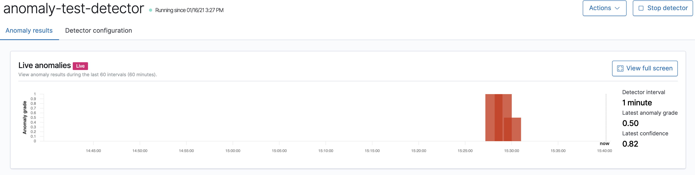

# How to use Anomaly Detector in Open Distro?

Example of using Anomaly Detector plugin from Open Distro on metricbeat data getting from source machine

## In order to run this example:

1. Run cluster with `docker-compose -f opendistro-docker/docker-compose.yml up`
2. Make sure that you have metricbeat indices
3. Create anomaly detector. Example of the request is located in scripts/create_anomaly_detector.sh
4. Go to Kibana and select Anomaly Detection tab.
5. Start your anomaly detector

